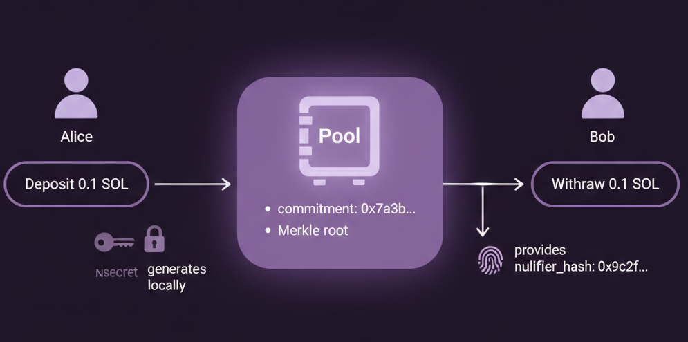
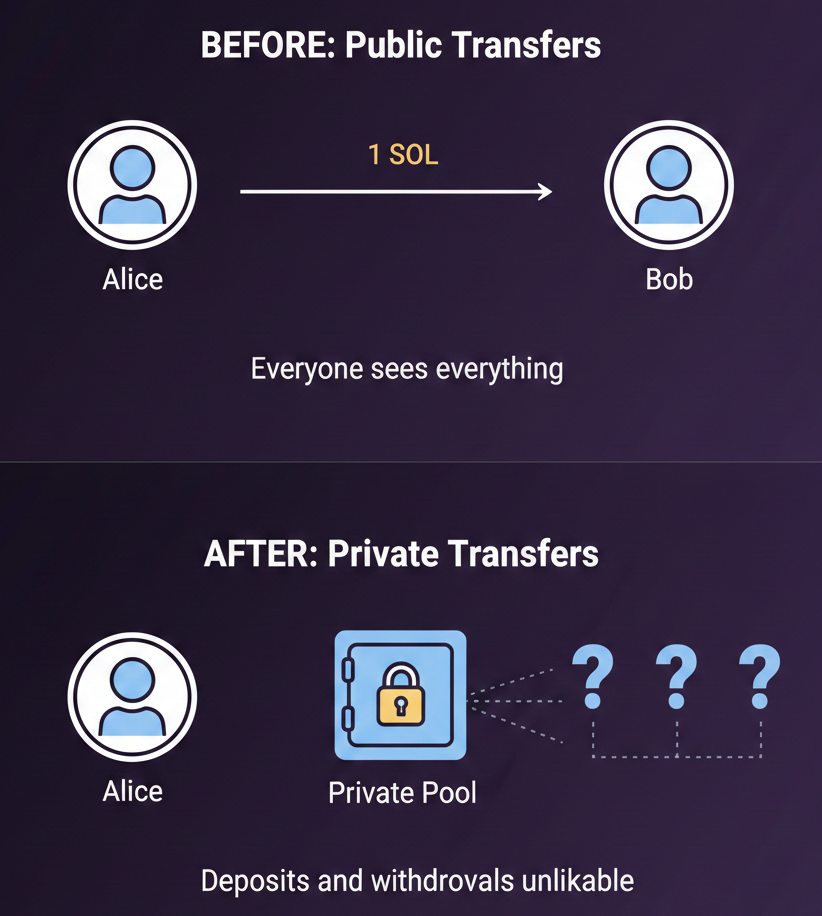
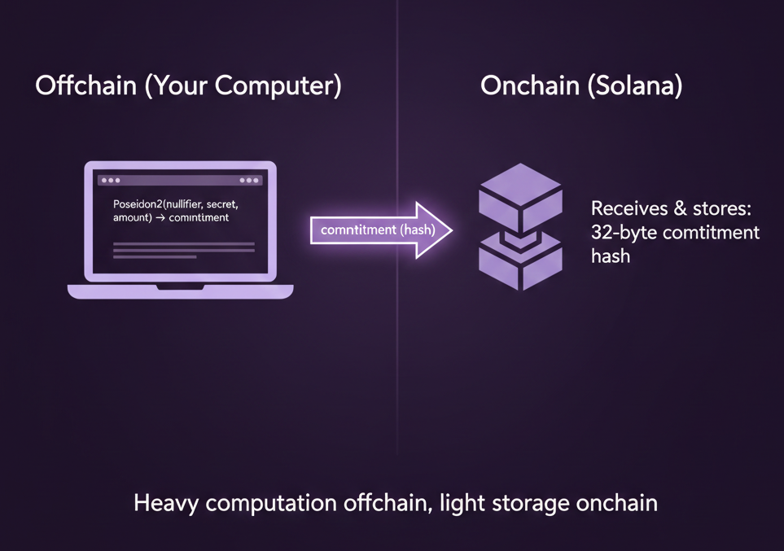

**~3 分钟**

# 第 0 步: 介绍

## 我们要构建什么

在这个项目中, 我们将在 Solana 上构建私密转账系统. 用户将 SOL 存入一个共享资金池, 之后再提取, 但没有任何方式可以将某笔存款与某笔提款关联起来.

---

## 我们究竟在隐藏什么

我们隐藏的不是谁存款, 谁提款, 因为这些信息在链上是公开可见的. 我们隐藏的是两者之间的关联.

没有隐私保护时, 这和你之前构建的托管合约类似, Alice 存款, Bob 提款, 所有人都知道 Alice 把钱转给了 Bob. 而在我们即将构建的项目里, Alice, Bob, Carol 都存入资金, 然后有人提款到某个地址, 没有人知道那个地址属于 Alice, Bob, Carol, 还是完全陌生的人.

在继续之前需要说明, 这是一个教学项目, 不建议部署到主网. 隐私工具在不同国家和地区有不同的法律含义, 在为真实用户构建类似系统之前, 请务必了解所在地的合规要求.

---

这套系统的核心是零知识证明. 零知识证明(ZK proof)允许你在不透露底层数据的情况下证明某件事为真, 就像证明你已满 18 岁, 但不用出示你的实际生日. 在我们的场景里, 你能证明自己向资金池发起了一笔有效存款, 而不用透露是哪一笔.

在这个项目中, 当你存款时, 你的设备会生成随机密钥, 将它们哈希后连同 SOL 一起发送到 Solana 上的资金池. 你会得到一张存款凭据(deposit note), 需要妥善保存, 或交给需要提款的人.

当有人想从资金池提款时, 他们使用存款凭据在本地设备上生成 ZK 证明, 将证明发送到 Solana, Solana 验证证明有效后释放资金. 密钥自始至终都不会离开你的设备.

---

在这个项目中, 我们将从一个公开资金池出发, 分 6 步将其改造为私密资金池. 我们会逐步讲解, 帮助你深入理解其中的运作原理. 所有相关代码都附在说明中, 欢迎克隆仓库跟着一起做! 学完之后, 你将理解 ZK 在 Solana 上是如何工作的. 我们开始吧!
