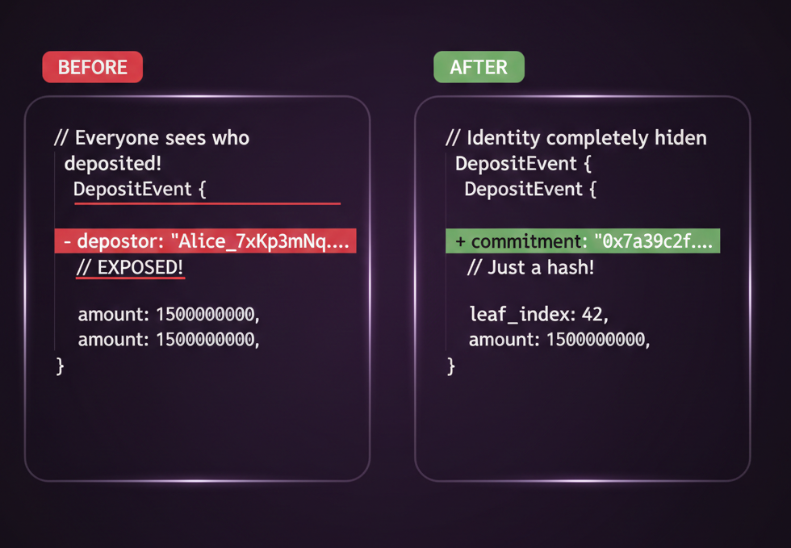
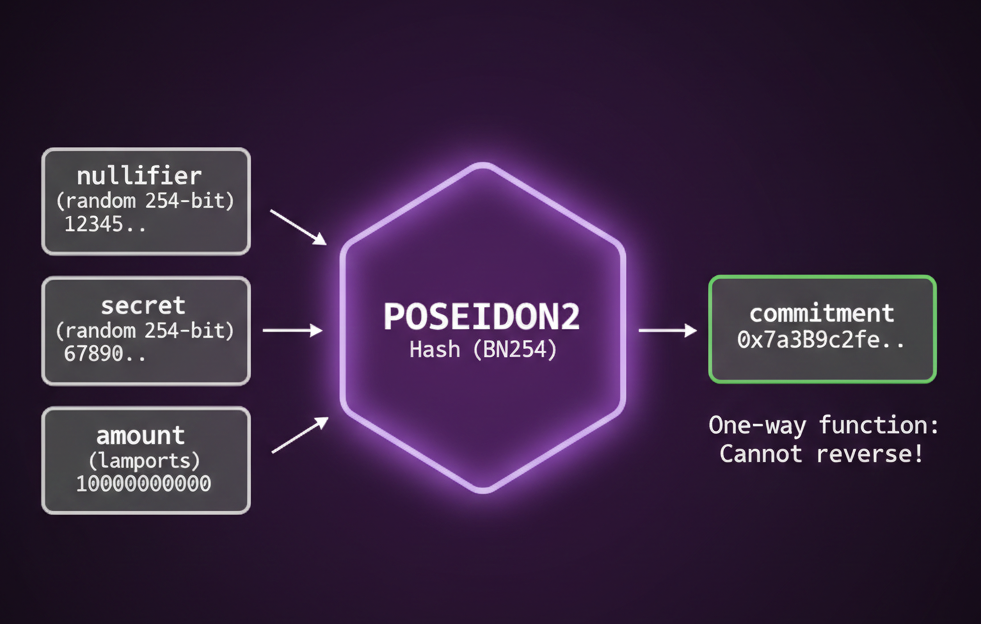
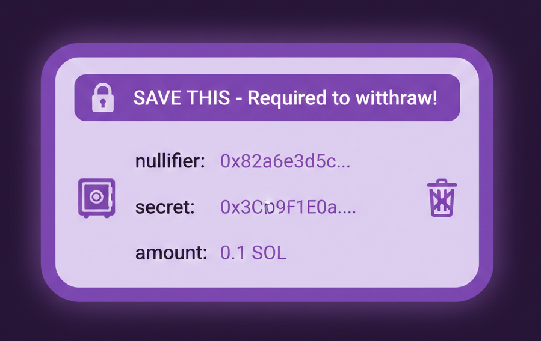
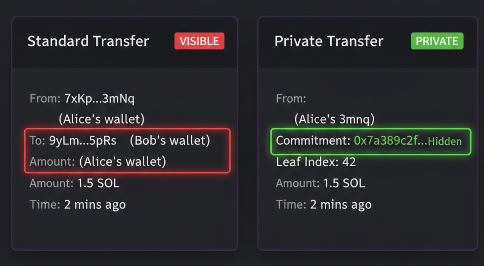

# 第 1 步: 隐藏存款详情

我们从存款功能开始. 交易本身始终记录在链上, 任何人都能看到 Alice 调用了存款函数. 但我们不希望程序把这些信息存储在资金池中, 因为那样一来, 当有人提款时, 关联就一目了然了.

目前, 存款事件会记录存款人的地址和金额. 我们要改成存储并触发一个 commitment(承诺值), 一个能代表这笔存款, 但不透露日后谁能认领它的密码学哈希.

---

Commitment 本质上就是一个哈希值. 在 ZK 领域, 我们称之为 commitment, 是因为你在"承诺"某些值, 但不对外透露它们.

把它想象成一个密封的信封, 所有人都能看到信封的存在, 但没人知道里面装着什么, 只有你自己清楚. 在我们的程序里, 每次有人存款都会存储一个 commitment, 它是对存款人的 nullifier, secret 和 amount 进行哈希运算的结果.

nullifier 和 secret 都是只有存款人知道的随机数, 提款时会用到它们. nullifier 的具体含义我们稍后再介绍.

---

存款时, 你需要在本地保存 nullifier, secret 和 amount, 这就是你的存款凭据, 你的收据.

如果你丢失了这张凭据, 资金将永久无法找回. 没有任何恢复机制, 因为只有你知道这些密钥.

---

在这一步中, 我们将:

1. 更新存款函数, 使其接受一个 commitment 参数
2. 更新 DepositEvent, 将存款人地址替换为 commitment

这样一来, 即使链上记录显示"Alice 调用了存款函数", 也无从得知资金池中哪笔 SOL 是 Alice 存入的.

---
