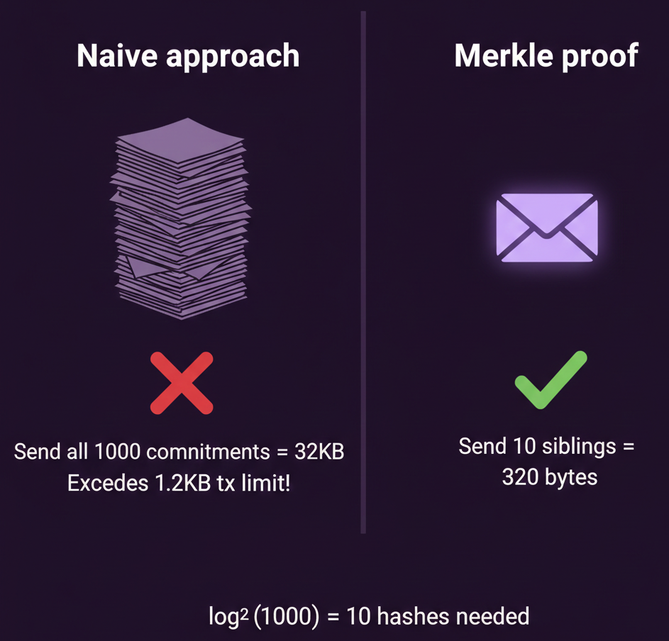
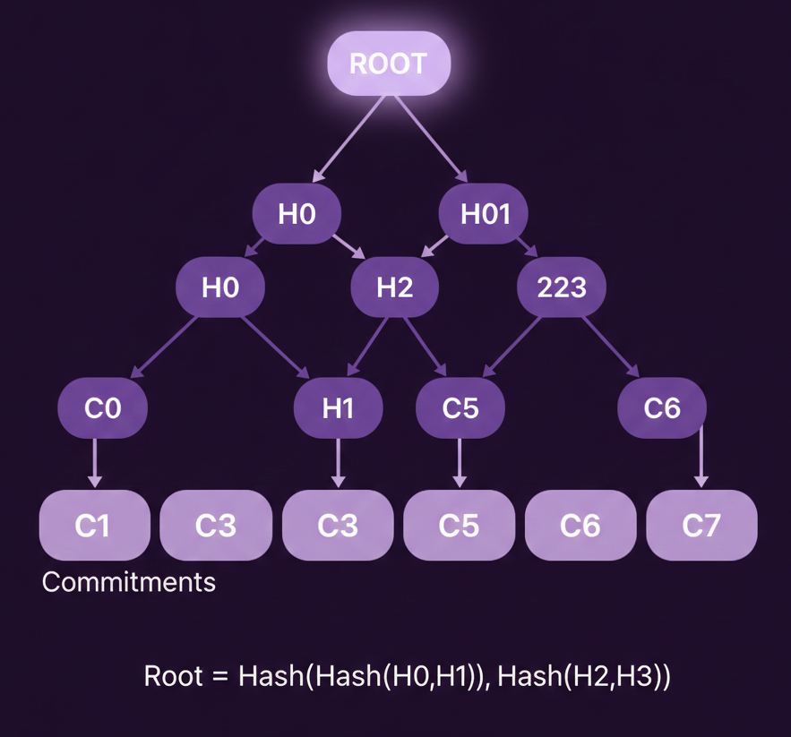

**~2.5 分钟**

# 第 2 步: 证明成员资格

既然已经解决了私密存款的问题, 接下来我们来处理提款. 首先, 我们需要让提款方能够证明资金池中存在某个特定的 commitment.

最朴素的做法是将所有 commitments 存储在链上并逐一比对. 但这样的话, 用户提款时必须随交易一并发送自己的 commitment, 立刻就暴露了是哪一笔. 另一种方式是在交易中发送全部 commitments, 但这会导致交易体积过大, 超出 Solana 的处理上限. 为此, 我们可以使用一种叫做 Merkle 树的数据结构.

---

Merkle 树是一种二叉树, 每个节点都是一个哈希值. 最底层的叶节点就是你的各个 commitments. 每对叶节点被哈希成一个父节点, 父节点再两两哈希, 如此逐层向上, 最终只剩顶部的一个哈希值, 即根节点, 也称 Merkle root.

要证明某个叶节点存在, 只需提供从该叶到根路径上的兄弟哈希. 对于 1024 个叶节点, 只需 10 个哈希值, 约 320 字节, 而无需提交全部 1024 个 commitments.

---

在 Solana 上, 我们只存储根节点, 一个 32 字节的哈希. 当有人想证明其存款存在时, 提供一个 Merkle proof, 我们将其与存储的根节点进行验证. 这大大节省了存储成本!

---

在这一步中, 我们将:

1. 添加 `leaf_index`, 用于追踪每笔存款在树中的位置
2. 添加树深度相关常量(10 层 = 最多 1024 笔存款)
3. 存储历史根节点, 确保针对近期根节点的证明仍然有效
4. 更新提款函数, 验证根节点存在

---
