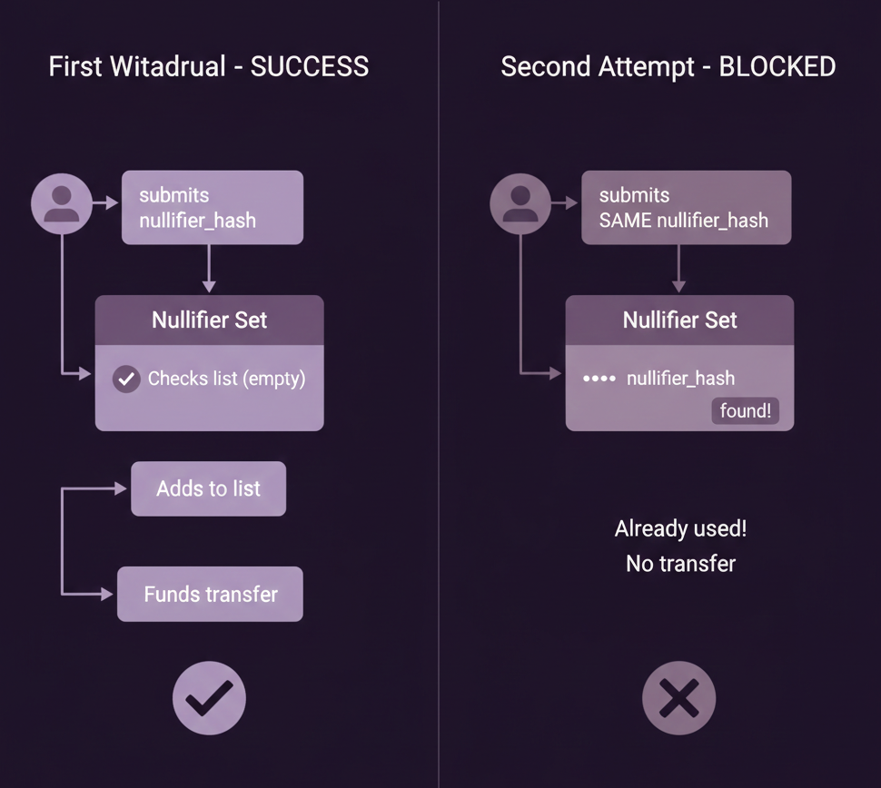
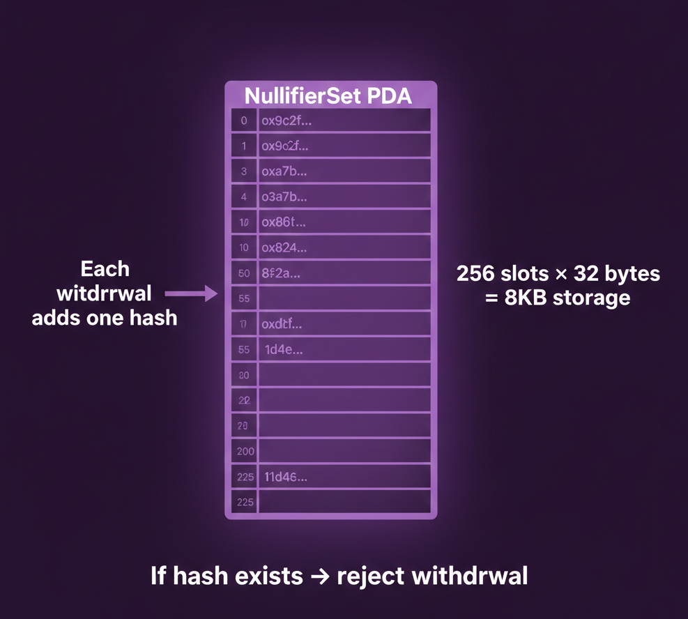

**~2 分钟**

# 第 3 步: 防止双重花费

现在我们可以在不记录存款人身份的情况下向资金池存款, 也可以通过证明 commitment 的存在来提款. 但有什么能阻止有人对同一笔存款反复提款, 或证明一个并不属于自己的 commitment 呢? 目前还没有!

这正是 nullifier(作废符)的用武之地, 也是本步骤的主题. nullifier 同时解决了两个问题: 它证明你拥有某个 commitment(因为只有你知道创建时所用的 nullifier), 同时防止双重花费(因为我们可以追踪哪些 nullifier 已被使用).

问题在于, 我们不能在提款时直接标记"commitment X 已被花费", 这样会把 commitment X 和该次提款关联起来. 我们需要在不暴露具体 commitment 的情况下追踪"某笔存款已被花费".

---

回顾存款流程, 存款时, 我们生成了一个随机 nullifier 并将其纳入 commitment 的计算中.

提款时, 你需要发送该 nullifier 的哈希值, 即 nullifier hash. 我们的 Solana 程序需要存储所有已使用的 nullifier hash, 这样如果你尝试二次提款, 就会再次提交相同的哈希, 程序可以拒绝该请求.

---

nullifier 与 commitment 之间无法建立关联. commitment 是对 nullifier, secret 和 amount 三者的哈希; nullifier hash 仅是对 nullifier 本身的哈希. 它们的输出完全不同, 无法互相推导或逆推. 观察者只能看到一笔带有某个 commitment hash 的存款, 和一笔带有某个 nullifier hash 的提款, 两者之间没有任何关联.

---

这一步相对简单. 我们将更新程序:

1. 创建 NullifierSet 账户, 用于存储已使用的 nullifier hash
2. 提款时检查该 nullifier 是否已被使用
3. 提款成功后将 nullifier 标记为已使用
4. 更新 WithdrawEvent, 加入 nullifier hash

