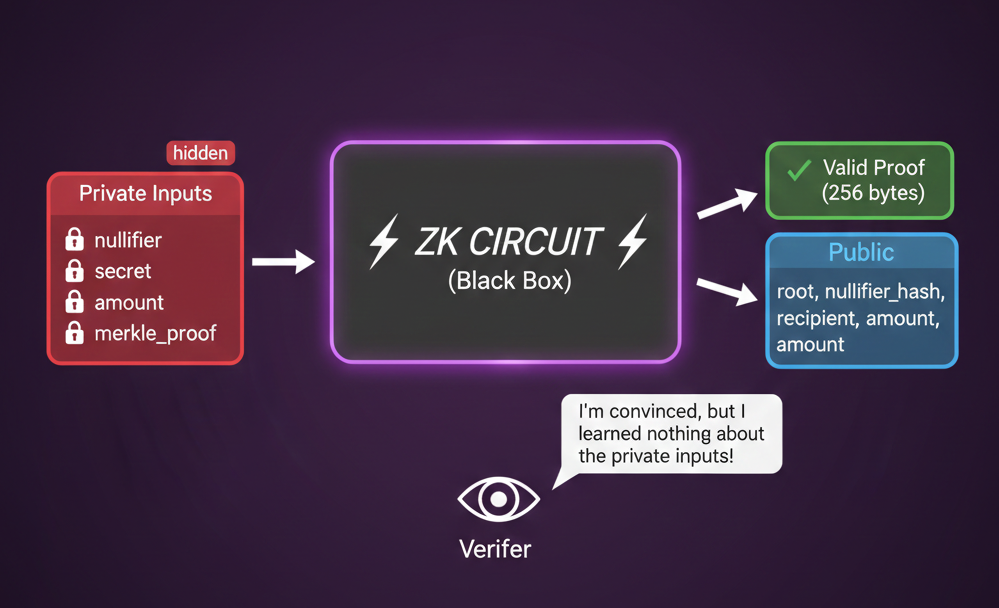

**~3 分钟**

# 第 4.1 步: ZK 电路

现在到了最有趣的部分, 零知识证明! 我们已经能够私密存款, 证明成员资格并防止双重花费. 但如果直接发送 Merkle proof, 就会暴露哪个 commitment 是我们的!

原因在于, 提交 Merkle proof 时, 你实际上是在说: "这是我位于叶节点 5 的 commitment, 以下是证明它在树中的兄弟哈希. "证明中包含了你的实际 commitment, 兄弟哈希路径和索引位置. 任何人都能看到你声明的具体 commitment, 追溯到存款时该 commitment 被加入的时间, 从而将你的存款钱包与提款钱包关联起来.

---

我们要证明的是: "我知道某个 nullifier, secret 和 amount; 对应的 commitment 在 Merkle 树中; nullifier hash 是正确的. "

Solana 上的验证者会确信我们持有一笔有效存款, 但对具体是哪笔存款一无所知.

---

这些电路可以用一种叫做 Noir 的语言编写. 它支持在客户端或后端服务器上生成证明, 用户再将证明发送到 Solana 进行验证. 我们选择 Noir 的原因是: 语法上与我们熟悉的 Rust 非常相近, 并且支持自由选择证明系统. 这意味着我们可以使用 Groth16! Groth16 非常适合我们的场景, 因为 Solana 需要体积小, 验证快的证明.

---

## 公开输入 vs 私有输入

**公开输入**(链上可见):
- Merkle root
- Nullifier hash
- 收款地址
- 金额

**私有输入**(永不透露):
- Nullifier
- Secret
- Merkle proof 路径
- 路径方向

---

## 本步骤内容

在这一步中, 我们将:

1. 查看完整的提款电路
2. 安装 Nargo(Noir 编译器)
4. 编译电路
5. 生成证明密钥和验证密钥

---
