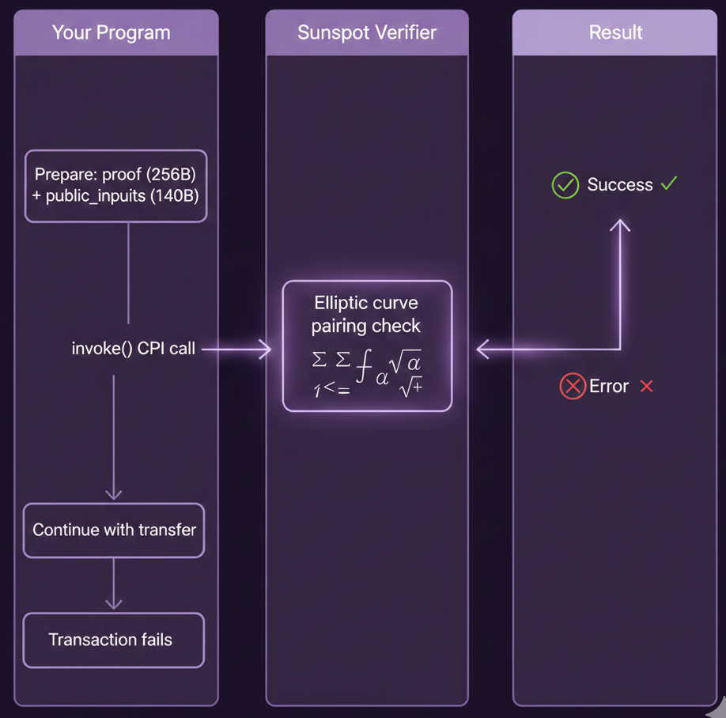

**~1.5 分钟**

# 第 4.3 步: 链上验证

我们已经有了 ZK 证明, 现在要在 Solana 上对其进行验证. 这是零知识证明拼图的最后一块.

---

实现方式是使用一个叫做 Sunspot 的工具. Sunspot 能够根据你的验证密钥生成一个独立的 Solana 程序. 这个验证程序内置了完整的验证逻辑, 如果你感兴趣可以查看源码, 不过里面包含大量 Groth16 数学运算, 我们无需深入理解.

之后, 我们的程序通过 CPI 调用这个验证程序. 如果证明无效, 整笔交易将原子性地失败回滚.

---

在这一步中, 我们将:

1. 安装 Sunspot
1. 使用 Sunspot 生成 Solana 验证程序
2. 将其部署到 devnet
3. 将验证程序的 Program ID 添加到我们的代码中
4. 添加 CPI 调用以验证证明
